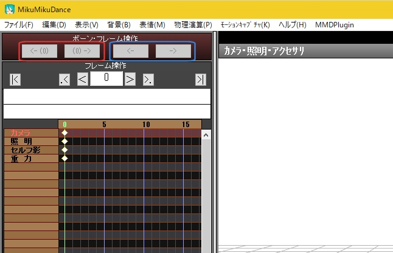

# MMDPluginDLL
おいがみ様の MMDPlugin で使えるMMDのプラグインです。  
今のところDLLは1つです。  

#### 使用方法  
MMDをおいがみ様の MMDPlugin(https://bowlroll.net/file/121761) を使える状態にしてください。  
MMDのバージョンは v931x64 以外では使えません。  
[ここ](https://github.com/Soul-chan/MMDPluginDLL/releases/download/1.0.0.0/MMDPluginDLL_1.0.0.0.zip)からダウンロードした qCameraModeUndo.dll を Plugin フォルダに入れてください。  

#### ビルド方法
ビルドにはおいがみ様の MMDPlugin ver0.41 64bit版 開発者用(https://bowlroll.net/file/135503) が必要です。  
解凍して MMDPlugin.lib を MMDPlugin フォルダに置いてください。  
mmd_plugin.h は改変させて頂いているので、上書きしないでください。  

#### qCameraModeUndo.dll
MMDのカメラモードでキーフレームの元に戻す/やり直しが出来る様になります。  
カメラモードでは元に戻す/やり直しの部分のボタンが4つになります。  
  
左側の赤枠部分は、カメラ/照明/セルフ影/重力用のボタンです。  
これら4つは共通でカメラ→照明→セルフ影の順番でキーフレームを操作した場合、セルフ影→照明→カメラの順で戻ります。  
  
右側の青枠部分は、アクセサリ用です。  
アクセサリはアクセサリ毎にバッファが独立していて、現在選択中のアクセサリのみ元に戻す/やり直しが出来ます。  
別のアクセサリを選択すると、そのアクセサリの元に戻す/やり直しが出来る様になります。  
  
キーボードショートカットはデフォルトでは以下のようになっています。  

    カメラ等の元に戻す    Ctrl + Z  
    カメラ等のやり直し    Ctrl + X  
    アクセサリの元に戻す  Ctrl + Shift + Z  
    アクセサリのやり直し  Ctrl + Shift + X  

初回起動時にDLLと同じフォルダに qCameraModeUndo.ini が作られます。  
このファイルを編集することでキーボードショートカット等の設定が可能です。

    AccessoryRedo=Ctrl + Shift + X  アクセサリのやり直しの設定です
    AccessoryUndo=Ctrl + Shift + Z  アクセサリの元に戻すの設定です
    CameraRedo=Ctrl + X  カメラ等のやり直しの設定です
    CameraUndo=Ctrl + Z  カメラ等の元に戻すの設定です
    
    UndoBuffMaxMB=100  内部で使用するバッファの容量の上限(MB)です

ショートカットはお好みに合わせてCtrl/Shift/Alt/英数を+で連結して指定してください。  
バッファ上限は実用上は10MBもあれば十分な気もしますが、念のため100MBをデフォルトにしています。  
100MBで大体カメラの上限キーフレーム数である1万フレーム分の操作を140回程保存できます。  
1フレームの操作なら約140万回分です。  
  
  
#### qDispPlayingFrame.dll
再生中フレーム数を表示するUIを追加します。  
「情報表示」のフレーム数表示を画面内に表示したくない、再生中以外でも表示したい、等の場合にお使いください。  
  
  
#### qSetCameraFollowBone.dll
「編集」メニューに「ｶﾒﾗのﾎﾞｰﾝ追従設定(F)」が追加されます。  
カメラの選択中のキーフレームの「ボーン追従」を一括変更出来ます。  
UIの「ボーン追従」で変更すると、カメラの位置等はリセットされますが、このプラグインではリセットされません。  
カメラのモーションを読み込んだ後、一括でボーン追従させたい場合等にお使いください。  
  
  
#### qSwapOutsideParent.dll
「編集」メニューに「外部親差し替え(O)」が追加されます。  
既存の外部親を別の外部親にすべて差し替える事が出来ます。  
差し替えるモデル/カメラ/アクセサリは選択できますが、モデル/アクセサリを選ぶと読み込まれている全モデル/アクセサリが対象になります。  
複数の「IKカメラボーン」を使い分ける際に使えるかと思います。  
  
  
#### qOutsideParentReaderWriter.dll
「ファイル」メニューに「外部親関係表示(R)」「外部親データ読込(O)」「外部親データ保存(T)」が追加されます。  
「外部親関係表示(R)」は外部親/ボーン追従が設定されているモデル/カメラ/アクセサリを検索して表示します。  
「外部親データ保存(T)」は外部親/ボーン追従の状態を*.vodファイル(CSV形式)に保存します。  
フレームの選択状態は関係なく、0フレーム目から全フレーム分保存されます。  
「外部親データ読込(O)」は*.vodファイルを読み込んで、モデル/カメラ/アクセサリに適用します。  
モデルに適用する際は既存フレームの外部親情報を維持しますが、カメラ/アクセサリは既存フレームの外部親情報は上書きされます。  

#### 更新履歴
・qCameraModeUndo.dll  
  1.0.0.0 初版公開  

#### ライセンス
GitHubでのライセンスは一番緩そうな[MIT](https://github.com/Soul-chan/MMDPluginDLL/blob/master/LICENSE)ライセンスにしています。  
基本的には好きにしていただいて構いません。  
プルリクエストも頂けるなら大歓迎です。  

#### 最後に
最近(?)自分でもMMDを触り始めたところカメラや照明で一旦キーを打つとやり直しが出来ないのが不便でプラグインでもないかな～と調べていたら、[おいがみ様の MMDUtility](https://github.com/oigami/MMDUtility) にたどり着きました。  
プロジェクトに CameraUndo なるものを発見したので拝見するとカメラの動きも含め記憶している様子…  
欲しいものとは少し違ったけどプラグイン作成のプロジェクトは公開されていたので、これをベースに自分で実装するかなと思い作り始めました。  
素晴らしいプロジェクトを公開してくださったおいがみ様には感謝しかありません。  
